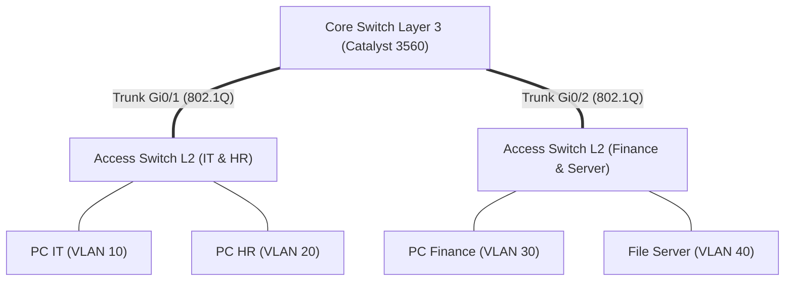

Catatan pengerjaan lab simulasi topologi jaringan kantor multi-departemen dengan segmentasi VLAN dan isolasi traffic.

---

## 🎯 Sasaran Lab (Objective)
1. Membagi jaringan ke dalam 4 segmen VLAN berbeda (IT, HR, Finance, Server Farm).
2. Mengonfigurasi Inter-VLAN Routing via Layer 3 Switch (SVI).
3. Menerapkan Extended ACL untuk mencegah departemen HR mengakses VLAN Finance.

---

## 🗺️ Diagram Topologi



---

## 📋 Skema Pengalamatan IP (VLSM)

| VLAN ID | Nama VLAN | Subnet | Gateway SVI | Usable Range |
|---|---|---|---|---|
| **VLAN 10** | IT_DEPT | `192.168.10.0/24` | `192.168.10.1` | `192.168.10.2` – `192.168.10.254` |
| **VLAN 20** | HR_DEPT | `192.168.20.0/24` | `192.168.20.1` | `192.168.20.2` – `192.168.20.254` |
| **VLAN 30** | FINANCE | `192.168.30.0/24` | `192.168.30.1` | `192.168.30.2` – `192.168.30.254` |
| **VLAN 40** | SERVERS | `192.168.40.0/24` | `192.168.40.1` | `192.168.40.2` – `192.168.40.254` |

---

## ⚙️ Langkah Konfigurasi Kunci

### 1. Konfigurasi SVI & Routing pada Core Switch
```text
CoreSW# configure terminal
CoreSW(config)# ip routing

CoreSW(config)# vlan 10,20,30,40
CoreSW(config)# exit

CoreSW(config)# interface vlan 10
CoreSW(config-if)# ip address 192.168.10.1 255.255.255.0
CoreSW(config-if)# no shutdown

CoreSW(config)# interface vlan 20
CoreSW(config-if)# ip address 192.168.20.1 255.255.255.0
CoreSW(config-if)# no shutdown

CoreSW(config)# interface vlan 30
CoreSW(config-if)# ip address 192.168.30.1 255.255.255.0
CoreSW(config-if)# no shutdown
```

### 2. Aturan Keamanan Extended ACL (Blokir HR ke Finance)
```text
CoreSW(config)# ip access-list extended BLOCK_HR_TO_FINANCE
CoreSW(config-ext-nacl)# deny ip 192.168.20.0 0.0.0.255 192.168.30.0 0.0.0.255
CoreSW(config-ext-nacl)# permit ip any any
CoreSW(config-ext-nacl)# exit

CoreSW(config)# interface vlan 20
CoreSW(config-if)# ip access-group BLOCK_HR_TO_FINANCE in
```

---

## ⚠️ Kendala & Troubleshooting (Gotchas)
* **Masalah**: PC di VLAN 10 tidak bisa ping gateway `192.168.10.1`.
* **Penyebab**: Trunk encapsulation pada switch L3 belum diset sebelum diaktifkan modenya.
* **Solusi**: Jalankan `switchport trunk encapsulation dot1q` sebelum `switchport mode trunk`.
