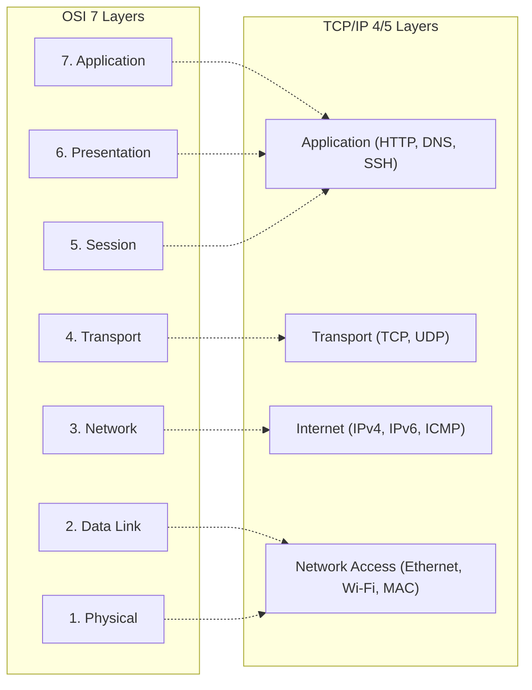
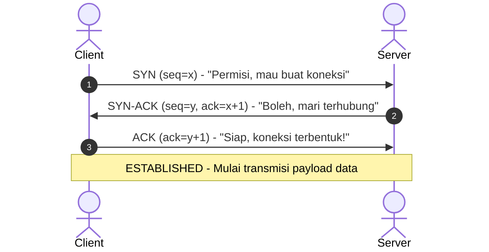

Model OSI (*Open Systems Interconnection*) dan protokol suite TCP/IP adalah fondasi utama komunikasi komputer di seluruh dunia.

---

## 🏗️ Perbandingan OSI 7-Layer vs Model TCP/IP

---

## 📦 Protocol Data Unit (PDU) & Enkapsulasi

Ketika data dikirim dari aplikasi menuju kabel/udara fisik, data dibungkus dengan header secara bertahap (*encapsulation*):

| Lapisan (Layer) | Nama PDU | Elemen Kunci yang Ditambahkan | Contoh Protokol |
|---|---|---|---|
| **Layer 7 (Application)** | **Data** | Payload data aplikasi | HTTP, HTTPS, SSH, DNS, DHCP |
| **Layer 4 (Transport)** | **Segment** | Source Port & Destination Port | TCP, UDP |
| **Layer 3 (Network)** | **Packet** | Source IP & Destination IP | IPv4, IPv6, ICMP, OSPF |
| **Layer 2 (Data Link)** | **Frame** | Source MAC, Destination MAC & FCS | Ethernet (802.3), Wi-Fi (802.11) |
| **Layer 1 (Physical)** | **Bits** | Sinyal listrik, cahaya optik, atau gelombang radio | RJ-45, Fiber Optic, Radio RF |

---

## 🤝 TCP 3-Way Handshake (Koneksi Andal)

Sebelum paket aplikasi (seperti HTTP GET) dikirimkan melalui TCP, koneksi harus dibangun melalui proses 3 langkah:

:::tip[Catatan Analisis Wireshark]
Jika pada filter Wireshark kamu melihat frame `SYN` berulang kali tanpa ada respon `SYN-ACK`, periksa kemungkinan:
1. Port pada server tertutup (*port closed*).
2. Firewall memblokir paket (drop/reject).
3. Terjadi routing loop atau default gateway salah konfigurasi.
:::
