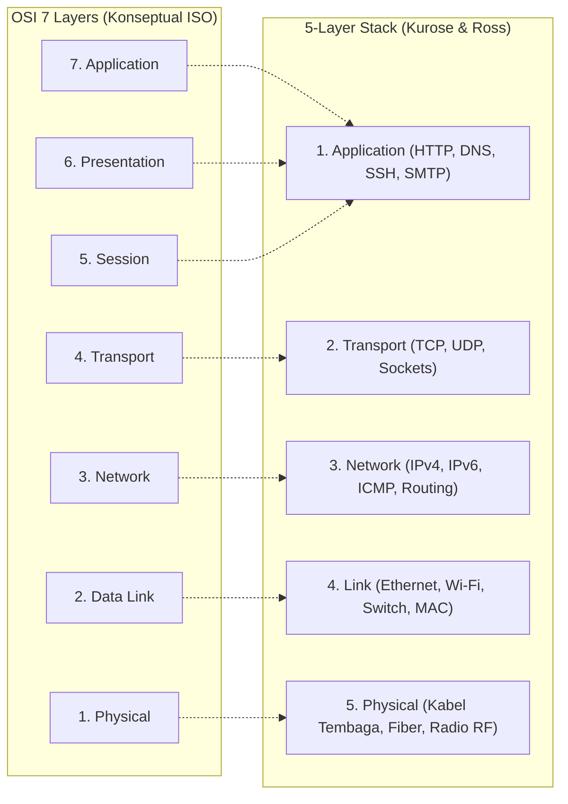
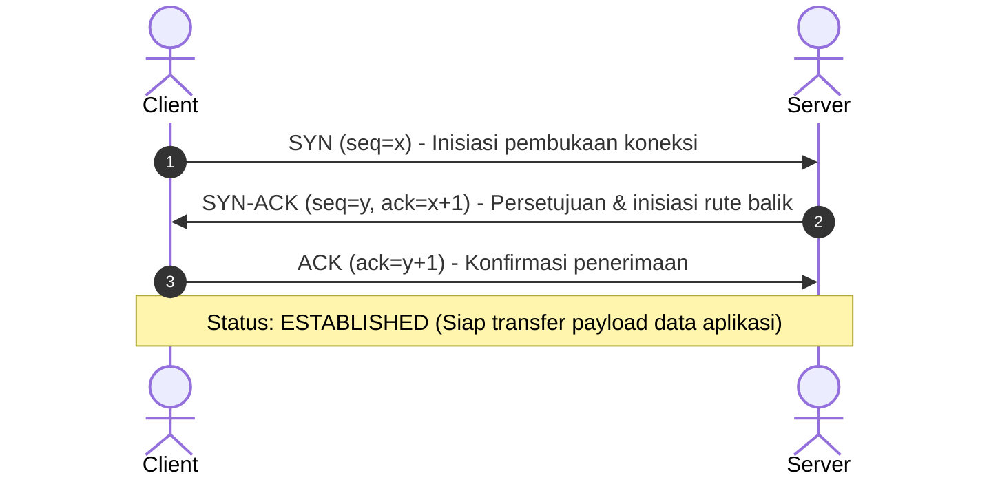

Model OSI (*Open Systems Interconnection*) dan protokol suite Internet (TCP/IP 5-Layer) adalah fondasi utama komunikasi komputer di seluruh dunia.

> 📚 **Referensi Utama**: Materi ini merujuk pada standar kurikulum internasional **[Computer Networking: A Top-Down Approach (Jim Kurose & Keith Ross)](https://gaia.cs.umass.edu/kurose_ross/index.php)**, di mana pemahaman arsitektur Internet dipelajari dari lapisan atas (*Application*) turun ke lapisan bawah (*Physical*) agar alur transmisi data logis dan mudah dipahami.

---

## 🏗️ Perbandingan OSI 7-Layer vs Internet Protocol Stack (Kurose & Ross)

Dalam implementasi Internet nyata, model yang paling banyak digunakan dalam kurikulum modern adalah **5-Layer Internet Protocol Stack** (menggabungkan fungsi Session dan Presentation ke dalam Application Layer):

---

## 📦 Protocol Data Unit (PDU) & Enkapsulasi

Ketika data dikirim dari aplikasi menuju media transmisi fisik, data dibungkus dengan header secara bertahap (*encapsulation*):

| Lapisan (Layer) | Nama PDU | Elemen Kunci yang Ditambahkan | Contoh Protokol / Servis |
|---|---|---|---|
| **Layer 5 (Application)** | **Message / Data** | Payload data aplikasi | HTTP/HTTPS, SSH, DNS, DHCP |
| **Layer 4 (Transport)** | **Segment** | Source Port & Destination Port | TCP, UDP |
| **Layer 3 (Network)** | **Datagram / Packet** | Source IP & Destination IP | IPv4, IPv6, ICMP, OSPF, BGP |
| **Layer 2 (Link)** | **Frame** | Source MAC, Destination MAC & FCS | Ethernet (802.3), Wi-Fi (802.11) |
| **Layer 1 (Physical)** | **Bits** | Sinyal listrik, modulasi cahaya, atau frekuensi radio | RJ-45 Cat6, Single/Multi-mode Fiber |

---

## 🤝 TCP 3-Way Handshake (Koneksi Transport Layer)

Sesuai penjelasan pada buku *Kurose & Ross (Bab Transport Layer)*, sebelum aplikasi dapat mentransmisikan data reliabel melalui TCP, koneksi dua arah harus dibangun melalui proses 3 langkah:

:::tip[Catatan Analisis Wireshark]
Jika pada filter Wireshark kamu melihat frame `SYN` berulang kali tanpa ada respon `SYN-ACK`, periksa kemungkinan:
1. Port pada server tertutup (*port closed*).
2. Firewall memblokir paket (*drop/reject policy*).
3. Terjadi routing loop atau default gateway salah konfigurasi.
:::
