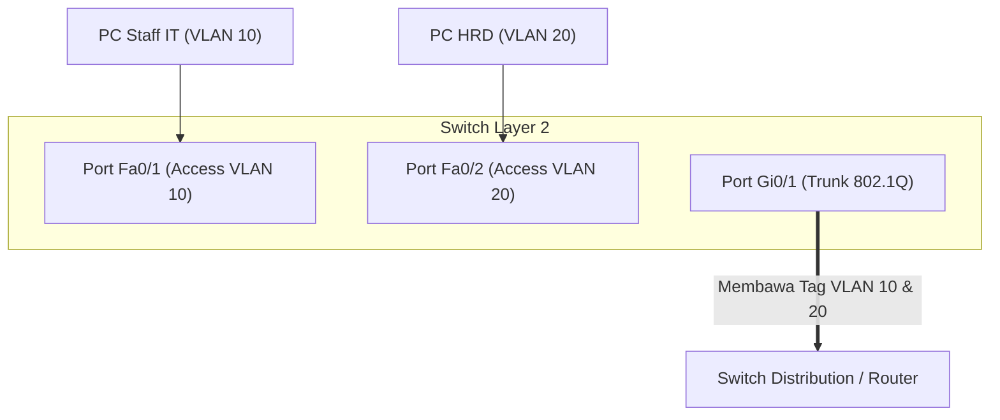

VLAN (Virtual Local Area Network) memungkinkan kita memecah satu switch fisik menjadi beberapa jaringan logis yang terisolasi secara Layer 2.

---

## 🔌 Access Port vs Trunk Port



* **Access Port**: Hanya membawa traffic dari **satu VLAN saja**. Frame yang keluar menuju PC tidak memiliki tag 802.1Q (untagged).
* **Trunk Port**: Membawa traffic dari **banyak VLAN sekaligus**. Switch menambahkan 4-byte header tag 802.1Q yang menandai asal VLAN ID frame tersebut.

---

## 💻 Cheat-sheet Konfigurasi Cisco IOS

### 1. Membuat Database VLAN
```text
Switch# configure terminal
Switch(config)# vlan 10
Switch(config-vlan)# name IT_DEPT
Switch(config-vlan)# exit

Switch(config)# vlan 20
Switch(config-vlan)# name HR_DEPT
Switch(config-vlan)# exit
```

### 2. Menetapkan Port Access ke VLAN
```text
Switch(config)# interface FastEthernet 0/1
Switch(config-if)# switchport mode access
Switch(config-if)# switchport access vlan 10
Switch(config-if)# no shutdown
```

### 3. Mengatur Uplink Trunk Port (802.1Q)
```text
Switch(config)# interface GigabitEthernet 0/1
Switch(config-if)# switchport mode trunk
Switch(config-if)# switchport trunk allowed vlan 10,20
Switch(config-if)# no shutdown
```

### 4. Perintah Verifikasi & Troubleshooting
```text
# Menampilkan semua VLAN aktif dan port asosiasinya
Switch# show vlan brief

# Menampilkan status trunk, encapsulation, dan allowed VLAN
Switch# show interfaces trunk
```
