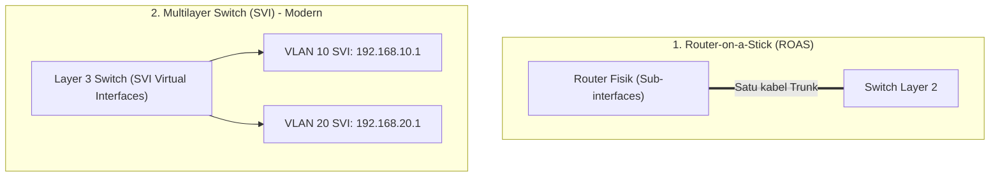

Secara default, perangkat di VLAN 10 tidak dapat berkomunikasi dengan perangkat di VLAN 20 karena terpisah secara Layer 2. Untuk menghubungkannya, kita membutuhkan proses **Inter-VLAN Routing**.

---

## ⚖️ Dua Metode Inter-VLAN Routing



---

## 🛠️ Metode 1: Router-on-a-Stick (ROAS)

Menggunakan satu kabel fisik trunk dari Switch ke Router, lalu membuat sub-interface virtual pada router per nomor VLAN:

```text
Router# configure terminal
Router(config)# interface GigabitEthernet 0/0
Router(config-if)# no shutdown
Router(config-if)# exit

! Sub-interface untuk VLAN 10
Router(config)# interface GigabitEthernet 0/0.10
Router(config-subif)# encapsulation dot1Q 10
Router(config-subif)# ip address 192.168.10.1 255.255.255.0

! Sub-interface untuk VLAN 20
Router(config)# interface GigabitEthernet 0/0.20
Router(config-subif)# encapsulation dot1Q 20
Router(config-subif)# ip address 192.168.20.1 255.255.255.0
```

---

## 🚀 Metode 2: Multilayer Switch (SVI) - Standar Enterprise

Jauh lebih cepat karena proses routing dilakukan pada level hardware (ASIC) di switch itu sendiri tanpa harus keluar melalui kabel router luar:

```text
! Aktifkan kemampuan routing di L3 Switch
Switch# configure terminal
Switch(config)# ip routing

! Buat SVI VLAN 10 sebagai Gateway
Switch(config)# interface vlan 10
Switch(config-if)# ip address 192.168.10.1 255.255.255.0
Switch(config-if)# no shutdown
Switch(config-if)# exit

! Buat SVI VLAN 20 sebagai Gateway
Switch(config)# interface vlan 20
Switch(config-if)# ip address 192.168.20.1 255.255.255.0
Switch(config-if)# no shutdown
```

:::caution[Troubleshooting Wajib]
Jika ping antar VLAN gagal pada L3 Switch:
1. Pastikan perintah global `ip routing` sudah dijalankan.
2. Pastikan minimal ada **satu port access aktif** yang terhubung ke perangkat di VLAN tersebut, atau interface VLAN akan berada dalam status `line protocol is down`.
:::
