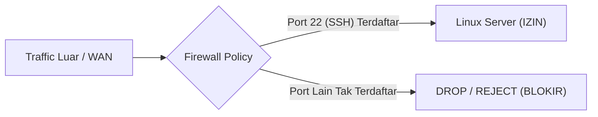

Firewall adalah lapisan pertahanan pertama yang mengatur paket mana yang diizinkan masuk (*ingress*) atau keluar (*egress*) dari sistem Linux.

---

## 🛡️ Kebijakan Default-Deny (Prinsip Utama)

Aturan baku keamanan jaringan: **Blokir semua koneksi masuk secara default**, lalu buka hanya port yang benar-benar dibutuhkan secara eksplisit.



---

## 🚀 Konfigurasi Praktis UFW (Uncomplicated Firewall)

UFW adalah antarmuka yang sangat ramah untuk mengelola filter kernel Linux `netfilter`/`iptables`.

```bash
# 1. Pasang policy default: tolak semua incoming, izinkan semua outgoing
sudo ufw default deny incoming
sudo ufw default allow outgoing

# 2. Izinkan port SSH (Port 22) - PENTING agar tidak terkunci keluar
sudo ufw allow 22/tcp comment 'Remote SSH'

# 3. Izinkan web server jika ada
sudo ufw allow 80/tcp comment 'HTTP'
sudo ufw allow 443/tcp comment 'HTTPS'

# 4. Izinkan subnet lokal tertentu saja mengakses servis tertentu
sudo ufw allow from 192.168.10.0/24 to any port 22

# 5. Aktifkan firewall
sudo ufw enable

# 6. Periksa status dan nomor urut rule
sudo ufw status numbered
```

---

## 🔒 Tips Hardening SSH Tambahan (`/etc/ssh/sshd_config`)

Selain firewall, amankan konfigurasi daemon SSH:
1. Ganti password authentication dengan **Public Key Authentication (Ed25519)**.
2. Nonaktifkan login root langsung: `PermitRootLogin no`.
3. Nonaktifkan otentikasi password biasa: `PasswordAuthentication no`.
